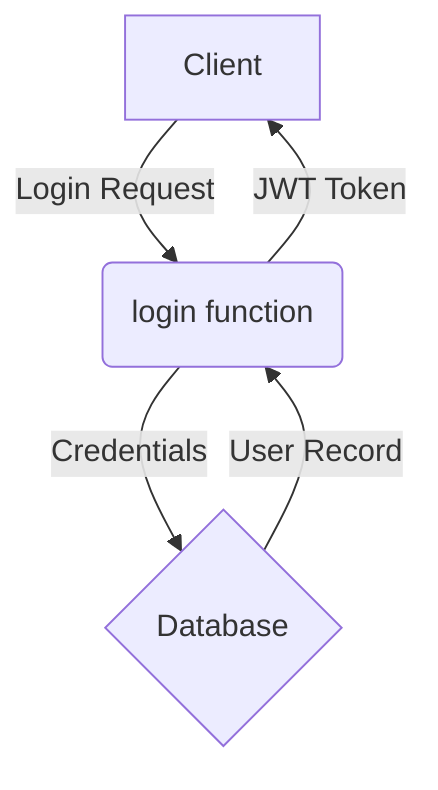

---
{
  "module": "auth",
  "owner": "wochagonnadu",
  "audience": "developer",
  "purpose": "Provides user authentication, registration, and session management.",
  "public_api": [
    "login",
    "logout",
    "register_user",
    "get_current_user"
  ],
  "inputs": [],
  "outputs": [],
  "config": {
    "env": [
      "JWT_SECRET_KEY",
      "DATABASE_URL"
    ],
    "files": [
      "config.yml"
    ]
  },
  "deps": {
    "internal": [
      "core.database"
    ],
    "external": [
      "fastapi",
      "passlib",
      "pyjwt"
    ]
  },
  "invariants": [],
  "danger_zones": []
}
---

# 1. Название

Модуль `auth`

# 2. Ответственность

Этот модуль отвечает за все, что связано с аутентификацией и управлением сессиями пользователей.
- Регистрация новых пользователей.
- Вход в систему (проверка пароля и выдача JWT-токена).
- Выход из системы.
- Предоставление информации о текущем аутентифицированном пользователе.

# 3. Публичные интерфейсы

| Имя | Тип | Описание |
| --- | --- | --- |
| login | function | Аутентифицирует пользователя и возвращает JWT-токен. |
| logout | function | Завершает сессию пользователя. |
| register_user | function | Регистрирует нового пользователя в системе. |
| get_current_user | function | Возвращает модель текущего аутентифицированного пользователя. |

# 4. Зависимости

- **Внутренние:** `core.database` (для доступа к базе данных пользователей).
- **Внешние:** `fastapi`, `passlib` (для хеширования паролей), `pyjwt` (для работы с JWT).

# 5. Конфигурация

- **Переменные окружения:** `JWT_SECRET_KEY`, `DATABASE_URL`.
- **Файлы:** `config.yml`.

# 6. Запуск и тесты

- Тестовые файлы: `test_auth.py`.
- Для запуска тестов выполните: `pytest mdoc/auth/test_auth.py`.

# 7. Поток данных (Mermaid)

# 8. Инварианты

- Секретный ключ JWT (`JWT_SECRET_KEY`) должен быть всегда определен.
- Пользователь не может быть аутентифицирован с неверным паролем.

# 9. Опасные зоны

- Изменение `JWT_SECRET_KEY` сделает недействительными все существующие сессии.
- Неправильная конфигурация `DATABASE_URL` приведет к полной неработоспособности модуля.
